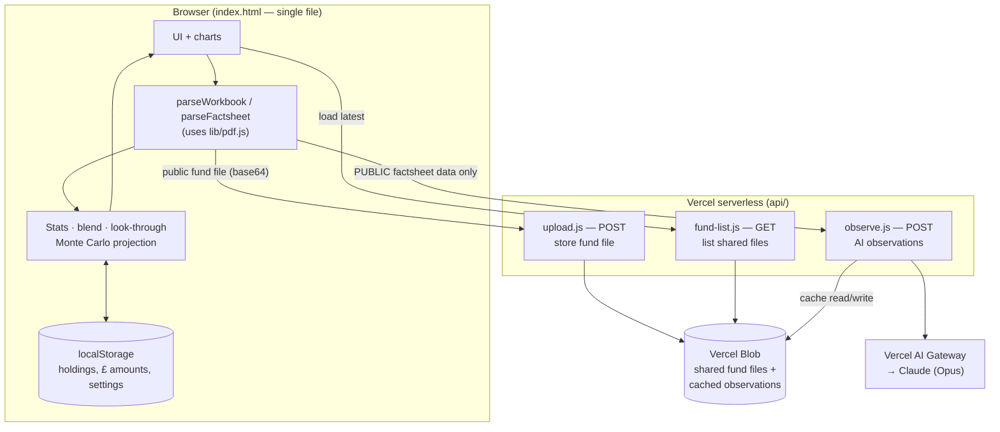

# Pension Fund Manager

An in-browser dashboard for understanding a workplace pension. You drop in the
fund price spreadsheets and factsheet PDFs you download each month; the app
parses them **in your browser**, computes performance and risk statistics,
blends them across your holdings, projects your pot to retirement with UK tax
built in, and — optionally — generates plain-English, AI-written observations
about each fund.

> **Information tool, not financial advice.** Every figure is historical and
> ignores fees, tax interplay, how funds move together, and your personal
> goals, timeframe and risk appetite. For a personal recommendation, speak to
> an FCA-authorised financial adviser.

---

## Apps

Both are single-file HTML pages, with their readers vendored in `lib/` — no build
step and no third-party requests for code.

| App | File | Served at |
|-----|------|-----------|
| **Pension Fund Manager** | `index.html` | `/` |
| **World Cup Draw** | `world-cup-draw.html` | `/world-cup-draw.html` |

---

## What the dashboard does

- **Parses fund data locally** — `.xlsx` price histories (prices & returns) and
  `.pdf` factsheets (charges, allocation, top holdings), individually or in a
  `.zip`. Nothing is uploaded to read it.
- **Reads your annual statements** — annual pension statement PDFs add a
  year-by-year breakdown (pot value, contributions, investment growth) and plot
  your real pot value over time. Unknown layouts are read on a best-effort basis
  rather than rejected — see [Statement formats](#statement-formats).
- **Computes per-fund stats** — capital return over 1M/6M/1Y/3Y, annualised
  return, annualised volatility, max drawdown, and a return-for-risk (Sharpe-style)
  ratio. Funds with under ~60 daily prices are flagged **NEW** and excluded from
  longer-window stats.
- **Blends your portfolio** — daily-rebalanced blended return, volatility,
  drawdown and OCF across the weights you set.
- **Look-through & overlap** — merges the top holdings from each factsheet,
  weighted by how much of your portfolio sits in each fund, to reveal effective
  exposure and hidden concentration.
- **Retirement projection** — a 1,500-path Monte Carlo simulation with UK tax
  built in (income-tax relief on contributions, salary-sacrifice vs take-home,
  the 25% tax-free lump sum capped at £268,275, the £60k annual allowance,
  CPI-real values, and a drawdown model).
- **Rule-based observations** — the "Things worth noticing" cards, generated
  mechanically from your data (portfolio-level, stays on device).
- **AI per-fund observations** *(optional, server-side)* — 3–5 plain-English
  cards per fund explaining what it holds and why its numbers look as they do.
  See [AI observations](#ai-per-fund-observations).
- **Shared fund files** — parsed fund spreadsheets/PDFs can be uploaded to a
  shared store so anyone using the app loads the latest data. **Your holdings
  and £ amounts are never uploaded** (see [Privacy](#privacy-model)).

---

## Architecture



### Frontend (`index.html`)

One self-contained HTML file: markup, CSS and an inline `<script>`. No build
step and no framework. The three file readers it needs — SheetJS, JSZip and
pdf.js — are **vendored in `lib/`** rather than loaded from a CDN, so a page
holding salary, date of birth and pot values makes no third-party request for
code, and it keeps working offline or behind a proxy that blocks CDNs. See
[`lib/README.md`](lib/README.md) for versions and how to update them. All
parsing and computation happen client-side.

Personal state (holdings, £ values, contributions, projection inputs, theme)
lives in `localStorage` under `fund_*` keys. Writes go through one wrapper, so a
failed save — quota exhausted, private browsing, site data switched off — raises
a banner asking you to export instead of being swallowed.

The page is usable beyond a desktop mouse: chart tooltips are bound to pointer
events so they work on touch, the upload area is a real keyboard control, the
fund dialog traps and restores focus, charts carry text alternatives pointing at
the equivalent table, and `@media print` gives a light, chrome-free layout for
saving a copy as PDF.

### Statement formats

The statement reader was written against the **2020** workplace "Pension Plan
statement" booklet (with the 2023+ condensed template added later). Statements
are not a standard document, so anything else — a later redesign, another
provider, a different wording — is handled by a deliberate fallback rather than
being rejected:

1. **Known template** → parsed in full, exactly as before.
2. **Unknown layout that still reads as a pension statement** → a best-effort
   pass pulls out whatever it can find with generic labels (pot value, employer
   and member contributions, AVCs, transfers in, investment growth, retirement
   estimate and dates). The year is stored flagged as `partial`, marked ⚠ in the
   year-by-year table, and the app flashes a banner saying it was modelled on the
   2020 format and listing what was and wasn't read. A guessed pot value is
   never plotted on the chart, and a partial re-read of a year already parsed in
   full only fills blanks — it never overwrites good figures.
3. **Nothing readable** → the file is reported, no year is invented, and the rest
   of the upload carries on.

The homepage carries a standing note saying the reader was modelled on 2020
statements, so this is visible before anyone uploads anything.

A statement is never mistaken for a fund factsheet: a factsheet now needs at
least one real factsheet field (charge, unit price, objective, performance table
or holdings) before it's loaded, so an unrecognised PDF can't become a phantom
fund. Dashboard sections also render independently, so one odd statement can't
blank the page.

### Serverless API (`api/`)

Standard Vercel Node functions (`export default handler(req, res)`):

| Endpoint | Method | Purpose |
|----------|--------|---------|
| `api/upload.js` | POST | Store a fund file (base64) in Vercel Blob so it's shared with everyone. |
| `api/fund-list.js` | GET | List the shared fund files, newest first. |
| `api/observe.js` | POST | Generate (and cache) AI observations for one fund. |

### Storage

- **Vercel Blob** — shared fund spreadsheets/PDFs (public fund data) and cached
  AI observations. Requires `BLOB_READ_WRITE_TOKEN`.
- **`localStorage`** — everything personal. Never leaves the device.

### AI per-fund observations

`api/observe.js` takes a single fund's **public factsheet data** and returns
3–5 observation cards via the **Vercel AI Gateway** (`ai` SDK, `generateObject`).

- **Model** — `OBSERVE_MODEL` env var, default `anthropic/claude-opus-4.6`.
  Chosen for synthesis quality; cost is negligible because output is cached.
- **Caching** — results are stored in Vercel Blob keyed by fund name +
  factsheet date, so each fund is generated once and stays stable.
- **Privacy** — only public factsheet fields are sent (name, objective,
  features, OCF, holdings, asset/geo split, performance vs benchmark). A
  server-side `publicFund()` guard strips anything else. Personal holdings and
  weights are never sent.
- **Guardrails** — the prompt is hard-constrained to *information, not advice*:
  reason only over the supplied figures, no outside facts, no predictions, and
  never a buy/sell/switch recommendation.
- **Graceful degradation** — if the gateway is unreachable (or the app is served
  as a static site with no API), the fetch fails silently and no cards render;
  everything else keeps working.

Observations appear as a **"What the data suggests"** section (marked with an
AI icon) in the fund-detail modal, and funds that have them get an AI marker on
their holdings card.

---

## Privacy model

The app draws a hard line between **public fund data** and **your personal
position**:

- **Public** — fund price histories, factsheets, and the stats derived from
  them. These may be shared (uploaded to Vercel Blob) so everyone loads the
  latest data, and a fund's public factsheet fields are what the AI observation
  endpoint receives.
- **Personal** — which funds you hold, your weights, your £ amounts,
  contributions and projection inputs. These stay in `localStorage` on your
  device and are **never uploaded** and **never sent to the AI**.

Rule-based portfolio observations run entirely client-side for this reason;
only the per-fund AI observations (public data) involve the server.

---

## Project layout

```
index.html              Pension Fund Manager (the whole app)
world-cup-draw.html     World Cup Draw app
api/
  upload.js             POST — store a fund file in Vercel Blob
  fund-list.js          GET  — list shared fund files
  observe.js            POST — AI per-fund observations (gateway + cache)
lib/                    Vendored readers — see lib/README.md for versions
  xlsx.full.min.js      SheetJS — .xlsx / .xls / .csv price histories
  jszip.min.js          JSZip — expands a dropped .zip of downloads
  pdf.min.js            pdf.js — factsheet and statement PDFs
  pdf.worker.min.js
scripts/
  check-syntax.mjs      Fast parse gate for the inline app script
  probe-gateway.mjs     Verify AI Gateway key + model slug before deploying
tests/
  app.test.mjs          Unit tests for the financial + parsing functions
  harness.mjs           Runs the real inline script (and the real SheetJS) in a sandbox
```

---

## Configuration

Set these as environment variables (Vercel project settings, or `.env.local`
for local runs):

| Variable | Needed for | Notes |
|----------|-----------|-------|
| `BLOB_READ_WRITE_TOKEN` | Shared files + observation cache | Provisioned by Vercel Blob. |
| `AI_GATEWAY_API_KEY` | AI observations | The AI SDK reads this name. `AI_GATEWAY_API` is accepted as an alias. Not needed if using Vercel OIDC. |
| `OBSERVE_MODEL` | AI observations (optional) | Gateway model slug; defaults to `anthropic/claude-opus-4.6`. |

---

## Local development

The frontend needs no build — open `index.html` over any static server:

```bash
python3 -m http.server 8099
# then visit http://localhost:8099/index.html
```

The `api/` functions run on Vercel; served as a plain static file, the
API-backed features (shared files, AI observations) are simply inactive.

### Verifying the AI Gateway

Before deploying the AI feature, confirm your key works and the model slug
resolves:

```bash
AI_GATEWAY_API_KEY='your-key' node scripts/probe-gateway.mjs
```

It prints the available Anthropic slugs, flags whether the configured one
resolves, and does one live test call.

### Checks & tests

```bash
npm run check   # parse-gate the inline app script (catches syntax breakage)
npm test        # unit tests for the financial functions
npm run ci      # both of the above
```

CI (`.github/workflows/ci.yml`) runs `check` + `test` on every push and PR.

---

## Deployment

Two targets, with different capabilities:

- **Vercel (full featured)** — runs the `api/` functions, so shared fund files
  and AI observations work. Set the environment variables above.
- **GitHub Pages (static subset)** — `.github/workflows/pages.yml` publishes the
  repo root on every push to `main`. The dashboard and all client-side analysis
  work, but `/api/*` calls 404, so shared files and AI observations are inactive.

The World Cup draw is available at `/world-cup-draw.html` on either target.

---

## Methodology notes

- Returns use each fund's **daily unit price** (capital / price return);
  income and dividends are excluded.
- **Volatility** is the annualised standard deviation of daily returns;
  **max drawdown** is the worst peak-to-trough fall.
- Blended figures assume **daily rebalancing** to your weights.
- **Fund charges** are shown in the charges section, and the projection has a
  **Charge basis** control. A pension fund's unit price normally has the charge
  taken out before the price is published, so a return derived from those prices
  is already net and the default doesn't deduct again; switch to *Deduct my
  charges* if your expected-return figure is a gross market assumption. The
  quoted cost of charges is a steady-return figure, so it won't move about the
  way a difference between two Monte Carlo runs would.
- Projections are a spread of simulated outcomes, **not a forecast**, and change
  with HMRC figures each Budget.

---

## License

MIT
